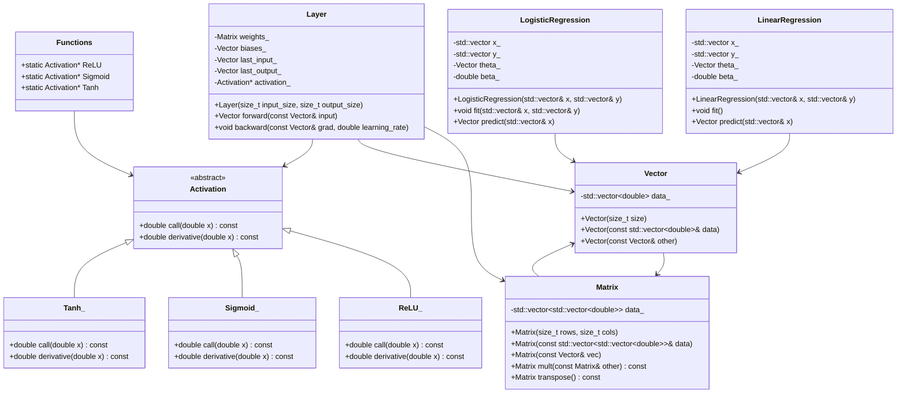

# Math Library

In this project we will be building a math library in `cpp`
This library will be used in building simple Neural Network library in the future.

## Structure

The library will be divided into the following parts:

1. Vector
2. Matrix
3. Activation Functions
4. Layer
5. Linear Regression
6. Logistic Regression

## UML

